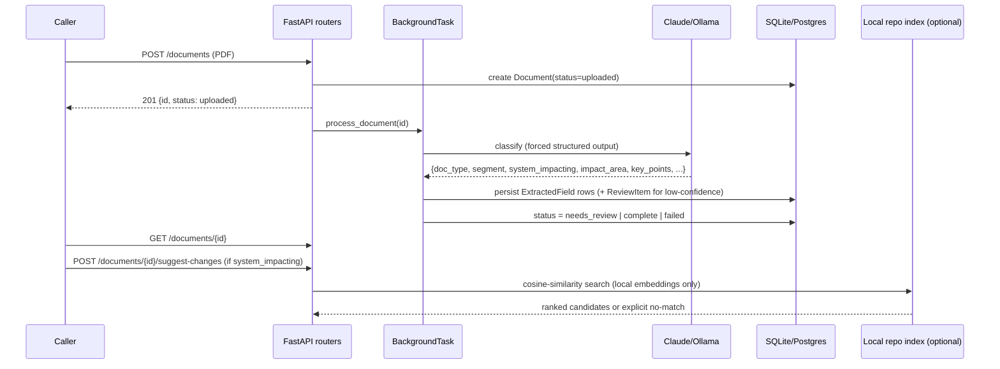

# Engineering Doc: BSE Circular Classifier

- Status: Done (implementation) — open items tracked in 03-todo.md
- Slug: `bse-circular-classifier`
- Linked overview: `./01-overview.md`
- Skills consulted (and what you took from each): none available at build time —
  `plan-workflow`/`plan-review`/`ai-build` were installed after the feature was built (see
  decisions.md #12). Leaned on the project's own established patterns instead: EAV field
  storage (decision #5), provider-abstraction-via-shared-schema (decision #9/#11).
- Author (agent/model + date): Claude / 2026-07-27
- Date: 2026-07-27

## 1. Summary

PDF circular in → LLM produces a structured classification (segment, system-impacting,
impact area, key points) via forced tool-use/JSON-schema output, with per-field confidence
→ stored as EAV rows → low-confidence fields routed to a human review queue → classified
circulars queryable by segment/impact/date/text. A stretch feature adds local, privacy-
preserving retrieval over a codebase to suggest which files a system-impacting circular
likely affects.

## 2. High-Level Design

- Components & boundaries: `extraction.py` (LLM call + schema, provider-agnostic
  normalization), `pipeline.py` (orchestration + review routing), `repo_index.py` (local
  RAG, hard-isolated from the classification LLM provider), routers per concern.
- Data flow: upload → background task → LLM → normalize → persist fields → gate on
  confidence → (optional) retrieval for system-impacting docs.

## 3. Low-Level Design

- **Domain / business logic:** classification schema in `extraction.py`
  (`EXTRACTION_TOOL`/`EXTRACTION_SCHEMA`) is the single contract shared by both providers;
  `_normalize()` is the one place raw LLM output becomes domain objects
  (`ExtractionResult`/`ExtractedFieldResult`).
- **Use case / application layer:** `pipeline.process_document` (classify → persist →
  gate), `review.resolve_review_item` (confirm/correct), `repo_index.search` (retrieval).
- **Shared interfaces / contracts:** the JSON schema (`EXTRACTION_SCHEMA`) is consumed
  identically by Claude's `tool_choice` and Ollama's `format` parameter — defined once,
  in `extraction.py`.
- **Data persistence:**
  - Schema: `Document`, `ExtractedField` (EAV: `field_name`/`field_value`/`confidence`/
    `source_note`/`is_list_item`), `ReviewItem` (now includes `original_value`, added this
    session — see decisions.md #12).
  - No migration tool; `Base.metadata.create_all` only (decision #5's tradeoff — flagged
    as a RISK in `00-review-20260727.md`, CTO lens).
- **Transport / API layer:** `documents.py` (`POST /documents`, `GET /documents/{id}`,
  `POST /documents/{id}/reprocess`, `POST /documents/{id}/suggest-changes`), `review.py`
  (`GET /review/queue`, `POST /review/{id}/resolve`), `query.py` (`GET /query/documents`),
  `reference.py` (`GET /reference/segments`, `/impact-areas`), `repo_index.py`
  (`POST /repo-index/build`, `GET /repo-index/status`). Registered in `app/main.py`.
- **Background work:** FastAPI `BackgroundTasks` with an isolated DB session
  (`_process_document_isolated`) — not a real queue; decision #6's accepted tradeoff.
- **Generated / mocked code:** none.
- **Configuration:** `LLM_PROVIDER`, `ANTHROPIC_API_KEY`, `OLLAMA_*`,
  `REVIEW_CONFIDENCE_THRESHOLD`, `REPO_SUGGESTION_ENABLED` (default off),
  `BACKEND_REPO_PATH`/`FRONTEND_REPO_PATH`, `REPO_SIMILARITY_THRESHOLD` — all in
  `app/config.py`.
- **Error handling & edge cases:** per-document failure isolation (`ExtractionError` →
  `FAILED`, retryable via `/reprocess`); malformed-but-valid-JSON LLM output now caught
  (fixed this session, see decisions.md #12); Ollama connection-refused and invalid-JSON
  cases produce distinct, actionable error messages.

## 4. Cross-Cutting Concerns

- Validation: PDF-only, non-empty, size-capped uploads; schema-forced LLM output.
- Auth / permissions: **none implemented.** Every endpoint is open to any caller who can
  reach the URL. Flagged as a BLOCKER in `00-review-20260727.md` (CIO/CTO lenses) for
  anything beyond a graded personal demo; not yet resolved.
- Observability: `Document.error_message` only; no structured request/latency logging.
- Caching: local embedding index caches by content hash (`repo_index.py`), so unchanged
  files aren't re-embedded on rebuild.
- Transactions / consistency / idempotency: each pipeline step commits incrementally;
  `/reprocess` deletes and recreates fields rather than diffing (acceptable at this scale).
- Security & performance: repo-suggestion embedding is hard-locked to a local model in
  code — no setting can route code to a cloud API (decision #11). CORS is `allow_origins=
  ["*"]` — a real gap once auth exists, and already a RISK on its own without auth.

## 5. Testing Strategy

- Unit tests (mocked collaborators): `test_extraction.py` (normalization, malformed-shape
  regression), `test_repo_index.py` (chunking, exclusion rules, cache-reuse, no-match
  branch), `test_ollama_extraction.py`.
- Integration tests (FastAPI `TestClient`, isolated SQLite per test): `test_documents.py`,
  `test_review.py`, `test_query.py`, `test_repo_suggestions.py`.
- End-to-end / contract tests: none — no deployed instance exists yet to test against
  (see 03-todo.md).
- What is explicitly NOT tested, and why: real Claude/Ollama API calls (all 46 tests mock
  the LLM boundary — no network/API key needed to run the suite); confidence-threshold
  correctness against real-world circulars (no labeled dataset exists).

## 6. Rollout

- Migration / deploy steps: none yet — not deployed. Planned: Railway/Render, background
  worker capable (not pure serverless), `DATABASE_URL` set to Postgres explicitly.
- Backward compatibility: N/A, first version.
- Feature flags: `REPO_SUGGESTION_ENABLED` (default off) functions as one.
- Follow-up work: see 03-todo.md "Newly Discovered Work."

## 7. Execution Strategy

- **Pattern:** Serial — single agent throughout. Appropriate for this project's size;
  `plan-workflow`'s parallel-write machinery would be overkill (confirmed N/A in
  `00-review-20260727.md`, Engineering Manager lens).
- No parallel pre-phase or wiring phase was needed.

### Shared choke points for THIS feature

| File / dir | Category | Strategy |
|------------|----------|----------|
| `app/main.py` | Router registry / app bootstrap | Serial (single agent — N/A for parallel concerns) |
| `app/models.py` | Schema | Serial; no migration tool, `create_all` only (RISK, see above) |
| `requirements.txt` | Package manifest | Serial, updated inline as dependencies were added |

### Task breakdown

Not applicable in table form — this was a single-agent serial build, not a multi-agent
parallel one. See `03-todo.md` for the actual chronological task log instead.

## 8. Review

- Reviewer comments: `00-review-20260727.md` — 3 blockers (no deploy, no GitHub push, and
  a since-fixed stuck-processing bug), 7 risks, 5 questions, 3 nits.
- Resolution / changes made: 2 of the 3 blockers were code defects, both fixed and tested
  same session (`ReviewItem.original_value`; `ExtractionError` wrapping for malformed LLM
  shapes). The remaining blockers (deploy, GitHub push, no auth) are process/scope, not
  code, and are tracked in `03-todo.md`.
- Approval: [ ] Approved by user (date)
